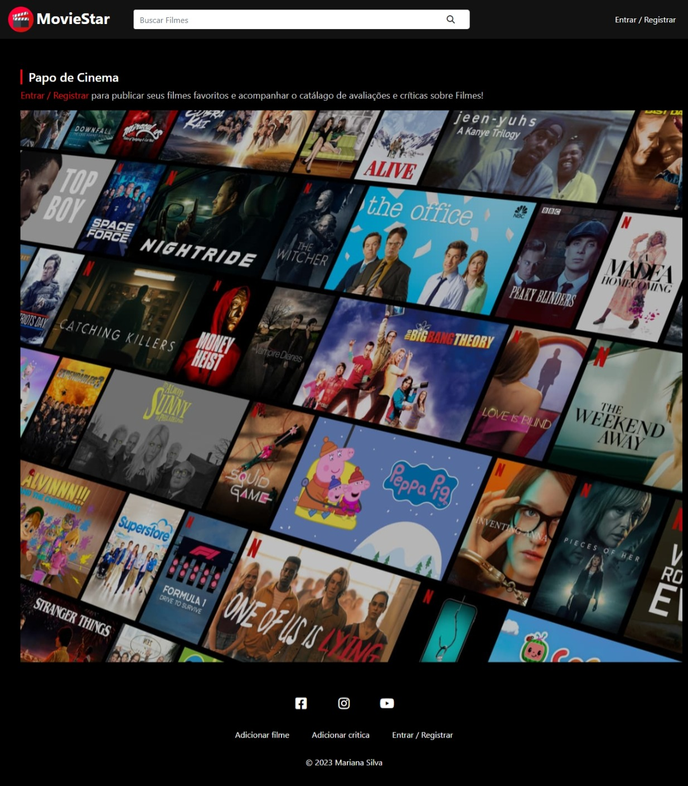

<h1 align="center"> MovieStar </h1>

Projeto desenvolvido no curso da Udemy: PHP do Zero a Maestria + 4 Projetos.

  

 

   

## 🚀 Tecnologias

Esse projeto foi desenvolvido com as seguintes tecnologias:

- HTML e CSS
- PHP
- MySQL

## 💻 Projeto

O <a>MovieStar</a> é uma plataforma colaborativa de filmes. O usuário cria seu perfil, cadastra seus filmes com uma crítica. Os outros usuários do sistema vão poder comentar e avaliar os filmes.

## Licença

Esse projeto está sob a licença MIT.

---

Feito com ♥ by Mariana Reis